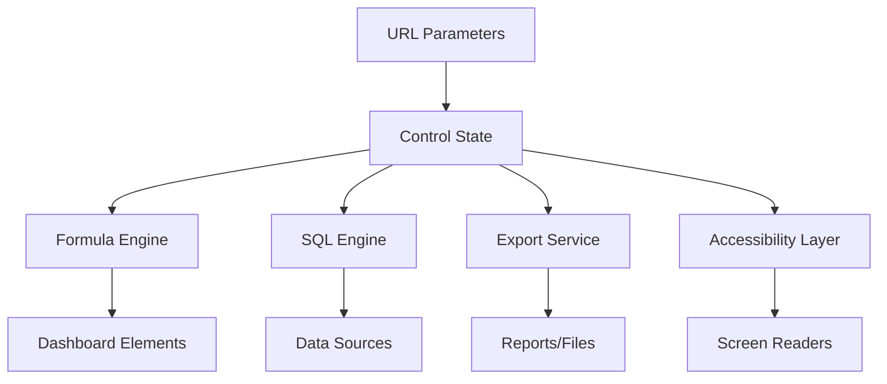

# Product Requirements Document - Missing Sigma Computing Features

## 1. Document Overview

### 1.1 Executive Summary
This PRD outlines the implementation of critical missing features to achieve **enterprise-level parity** with Sigma Computing's filters and controls functionality. Based on our gap analysis, we've identified 12 major feature categories that need implementation to transform our dashboard builder into a professional business intelligence platform.

### 1.2 Objectives
- **Primary**: Achieve feature parity with Sigma Computing's core functionality
- **Secondary**: Enable enterprise deployment with compliance and scalability
- **Tertiary**: Improve user experience and competitive positioning

### 1.3 Success Metrics
- 100% of HIGH PRIORITY features implemented
- 80% of MEDIUM PRIORITY features implemented  
- Enterprise-ready accessibility compliance
- 50% improvement in user workflow efficiency

---

## 2. High Priority Features (Must-Have)

### 2.1 URL Parameters & Query String Support

#### 2.1.1 Overview
**Goal**: Enable control value setting via URL parameters for embedding and sharing
**Complexity**: Low (1-2 weeks)
**Business Impact**: HIGH

#### 2.1.2 Functional Requirements

**URL Parameter Syntax**:
```typescript
// Single value controls
?controlId=value

// Number range controls  
?controlId=min:100,max:500

// Date range controls
?controlId=min:2024-01-01,max:2024-12-31

// Multi-select controls
?controlId=value1,value2,value3

// Special values
?controlId=:null    // Clear control
?controlId=:empty   // Empty string
```

**Core Features**:
- URL parameter parsing on dashboard load
- Control state initialization from URL
- URL update on control value changes
- URL encoding/decoding for special characters
- Support for all control types

**Technical Requirements**:
```typescript
interface URLParameterService {
  parseControlValues(urlParams: URLSearchParams): ControlStateMap;
  updateURL(controlId: string, value: any): void;
  encodeControlValue(value: any, controlType: ControlType): string;
  decodeControlValue(encoded: string, controlType: ControlType): any;
}
```

#### 2.1.3 Implementation Details

**Phase 1**: Basic URL parameter support
- URL parsing utility functions
- Control state initialization from URL
- URL update on control changes

**Phase 2**: Advanced features
- Embed URL generation
- Public sharing URLs
- URL validation and error handling

**Phase 3**: Security & optimization
- XSS protection
- URL length optimization
- Parameter compression for complex states

#### 2.1.4 Acceptance Criteria
- [ ] All control types support URL parameter setting
- [ ] URL automatically updates when controls change
- [ ] Dashboard state restores correctly from URL
- [ ] Special characters are properly encoded/decoded
- [ ] Error handling for invalid URL parameters

---

### 2.2 Control Value References in Formulas

#### 2.2.1 Overview
**Goal**: Enable referencing control values in calculated columns and formulas
**Complexity**: Medium (2-4 weeks)
**Business Impact**: HIGH

#### 2.2.2 Functional Requirements

**Syntax Examples**:
```typescript
// Single value reference
[ControlID]

// Range control references
[RangeControlID].min
[RangeControlID].max

// Date range references
[DateRangeID].start
[DateRangeID].end

// Multi-select array functions
ArrayContains([ListControlID], "value")
ArrayLength([ListControlID])
```

**Formula Integration**:
- Control references in calculated columns
- Real-time formula recalculation
- Type-safe control value usage
- Error handling for invalid references

**Technical Requirements**:
```typescript
interface FormulaEngine {
  parseControlReferences(formula: string): string[];
  evaluateFormula(formula: string, controlValues: Record<string, any>): any;
  validateControlReference(controlId: string, type: ControlType): boolean;
  getControlValueForFormula(controlId: string, path?: string): any;
}
```

#### 2.2.3 Implementation Details

**Phase 1**: Basic control references
- Control ID parsing in formulas
- Single value control support
- Formula validation and error handling

**Phase 2**: Advanced references
- Range control .min/.max support
- Date range .start/.end support
- Array functions for multi-select

**Phase 3**: Performance optimization
- Memoized formula calculations
- Dependency tracking
- Incremental recalculation

#### 2.2.4 Acceptance Criteria
- [ ] All control types can be referenced in formulas
- [ ] Formulas recalculate when control values change
- [ ] Proper error messages for invalid references
- [ ] Type checking for control value usage
- [ ] Performance optimized for large datasets

---

### 2.3 Custom SQL Statement Integration

#### 2.3.1 Overview
**Goal**: Enable control value references in custom SQL queries
**Complexity**: High (4-6 weeks)
**Business Impact**: HIGH

#### 2.3.2 Functional Requirements

**SQL Parameter Syntax**:
```sql
-- Basic parameter substitution
SELECT * FROM table WHERE column = ${controlId}

-- Range parameters
SELECT * FROM table WHERE 
  value >= ${rangeControl.min} AND 
  value <= ${rangeControl.max}

-- Array parameters for IN clauses
SELECT * FROM table WHERE 
  category IN (${listControl})
```

**Security Features**:
- SQL injection prevention
- Parameter type validation
- Whitelist-based parameter substitution
- Query plan caching

**Technical Requirements**:
```typescript
interface SQLParameterEngine {
  parseParameters(sql: string): ParameterReference[];
  substituteParameters(sql: string, controlValues: Record<string, any>): string;
  validateSQL(sql: string): ValidationResult;
  sanitizeParameterValue(value: any, type: DataType): string;
}
```

#### 2.3.3 Implementation Details

**Phase 1**: Basic parameter substitution
- Parameter parsing and validation
- Safe value substitution
- SQL injection protection

**Phase 2**: Advanced features
- Complex parameter types (arrays, ranges)
- Query optimization
- Error handling and logging

**Phase 3**: Performance & caching
- Query plan caching
- Parameter type inference
- Batch parameter updates

#### 2.3.4 Acceptance Criteria
- [ ] Control values can be referenced in SQL queries
- [ ] SQL injection protection is comprehensive
- [ ] All control types supported in SQL context
- [ ] Proper error handling for SQL issues
- [ ] Performance optimized for frequent updates

---

### 2.4 Export & Report Integration

#### 2.4.1 Overview
**Goal**: Enable export functionality with control-driven filtering
**Complexity**: High (4-8 weeks)
**Business Impact**: HIGH

#### 2.4.2 Functional Requirements

**Export Types**:
- PDF dashboard export with current control state
- Excel data export with applied filters
- PNG/JPG image export
- CSV data export

**Report Features**:
- Scheduled exports with control parameters
- Email burst functionality
- Custom report templates
- Export history and management

**Technical Requirements**:
```typescript
interface ExportService {
  exportDashboard(format: ExportFormat, controlState: ControlState): Promise<Blob>;
  scheduleReport(config: ReportConfig): Promise<ScheduleResult>;
  generateEmailBurst(controlValues: any[], template: ReportTemplate): Promise<void>;
  getExportHistory(filters?: ExportHistoryFilters): Promise<ExportRecord[]>;
}
```

#### 2.4.3 Implementation Details

**Phase 1**: Basic export functionality
- PDF export with control state
- Excel/CSV data export
- Image export capabilities

**Phase 2**: Scheduled reporting
- Report scheduling system
- Email integration
- Template management

**Phase 3**: Advanced features
- Email burst functionality
- Export history tracking
- Performance optimization

#### 2.4.4 Acceptance Criteria
- [ ] All export formats include current control state
- [ ] Scheduled reports work with control parameters
- [ ] Email burst functionality operational
- [ ] Export history tracking implemented
- [ ] Performance acceptable for large dashboards

---

### 2.5 Accessibility & Compliance

#### 2.5.1 Overview
**Goal**: Implement comprehensive accessibility support for enterprise compliance
**Complexity**: High (4-6 weeks)
**Business Impact**: HIGH

#### 2.5.2 Functional Requirements

**WCAG 2.1 AA Compliance**:
- Screen reader compatibility
- Keyboard navigation support
- Color contrast compliance
- Focus management
- ARIA labels and roles

**Section 508 Compliance**:
- Alternative text for visual elements
- Keyboard accessibility
- Audio/video alternatives
- Time-based media controls

**Technical Requirements**:
```typescript
interface AccessibilityService {
  validateARIA(element: HTMLElement): ValidationResult[];
  checkKeyboardNavigation(container: HTMLElement): boolean;
  validateColorContrast(element: HTMLElement): ContrastResult;
  generateARIALabels(controlConfig: ControlConfig): ARIAAttributes;
}
```

#### 2.5.3 Implementation Details

**Phase 1**: Basic accessibility
- ARIA labels for all controls
- Keyboard navigation
- Focus management

**Phase 2**: Advanced compliance
- Screen reader optimization
- Color contrast compliance
- Alternative interaction methods

**Phase 3**: Testing & validation
- Automated accessibility testing
- Manual testing with assistive technology
- Compliance documentation

#### 2.5.4 Acceptance Criteria
- [ ] WCAG 2.1 AA compliance achieved
- [ ] All controls keyboard accessible
- [ ] Screen reader compatibility verified
- [ ] Color contrast ratios meet standards
- [ ] Comprehensive accessibility testing completed

---

## 3. Medium Priority Features

### 3.1 Data Model Integration

#### 3.1.1 Overview
**Goal**: Enable controls to target data models and pass parameters to datasets
**Complexity**: High (4-6 weeks)
**Business Impact**: Medium

#### 3.1.2 Core Features
- Control-to-data-model parameter passing
- Dataset parameter targeting
- Cross-workbook control references
- Data model filter inheritance

### 3.2 Advanced Filter Configuration

#### 3.2.1 Overview
**Goal**: Implement sophisticated filter value management and display options
**Complexity**: Medium (2-3 weeks)
**Business Impact**: Medium

#### 3.2.2 Core Features
- Sort by frequency (ascending/descending)
- Display value vs. data value mapping
- 200-item limit with pagination
- Dynamic value source refresh

### 3.3 Data Element Filter Conversion

#### 3.3.1 Overview
**Goal**: Enable conversion of element-level filters to dashboard controls
**Complexity**: Medium (2-3 weeks)
**Business Impact**: Medium

#### 3.3.2 Core Features
- Right-click context menu for conversion
- Automatic target configuration
- Filter setting preservation
- Bidirectional conversion support

### 3.4 Cross-Page Control Synchronization

#### 3.4.1 Overview
**Goal**: Advanced syncing capabilities across dashboard pages
**Complexity**: Medium (3-4 weeks)
**Business Impact**: Medium

#### 3.4.2 Core Features
- Cross-page sync groups
- Independent unsyncing
- Sync state persistence
- Conflict resolution

### 3.5 Mobile & Touch Optimization

#### 3.5.1 Overview
**Goal**: Optimize control interfaces for mobile and touch devices
**Complexity**: Medium (3-4 weeks)
**Business Impact**: Medium

#### 3.5.2 Core Features
- Touch-friendly slider interactions
- Mobile-optimized dropdowns
- Gesture support
- Responsive breakpoints

---

## 4. Low Priority Features

### 4.1 Dynamic Text & Title Integration

#### 4.1.1 Overview
**Goal**: Reference control values in element titles and text
**Complexity**: Low (1-2 weeks)
**Business Impact**: Low

#### 4.1.2 Core Features
- Control references in titles
- Real-time text updates
- Formula-based text generation
- Contextual information display

---

## 5. Technical Architecture

### 5.1 System Integration Points

```typescript
// Core service interfaces
interface ControlValueService {
  getValue(controlId: string): any;
  setValue(controlId: string, value: any): void;
  subscribe(controlId: string, callback: (value: any) => void): () => void;
}

interface FormulaService {
  evaluate(formula: string, context: Record<string, any>): any;
  parseReferences(formula: string): string[];
  validate(formula: string): ValidationResult;
}

interface ExportService {
  export(format: ExportFormat, options: ExportOptions): Promise<Blob>;
  schedule(config: ScheduleConfig): Promise<void>;
  history(): Promise<ExportRecord[]>;
}

interface AccessibilityService {
  validate(element: HTMLElement): ValidationResult[];
  enhance(element: HTMLElement): void;
  test(): Promise<AccessibilityReport>;
}
```

### 5.2 Data Flow Architecture



### 5.3 Performance Considerations

**Optimization Strategies**:
- Debounced control value updates
- Memoized formula calculations
- Lazy loading for large datasets
- Efficient DOM updates
- Query result caching

**Scalability Requirements**:
- Support for 100+ controls per dashboard
- Handle datasets with 1M+ rows
- Real-time updates with <100ms latency
- Memory usage <50MB for typical dashboard

---

## 6. Implementation Roadmap

### Phase 1: Foundation (4-6 weeks)
**Priority**: HIGH
- URL Parameters & Query String Support
- Control Value References in Formulas
- Basic Accessibility Implementation

### Phase 2: Enterprise Features (6-8 weeks)  
**Priority**: HIGH
- Custom SQL Statement Integration
- Export & Report Integration
- Advanced Accessibility Compliance

### Phase 3: Professional Features (4-6 weeks)
**Priority**: MEDIUM
- Data Model Integration
- Advanced Filter Configuration
- Data Element Filter Conversion

### Phase 4: Enhancement (4-6 weeks)
**Priority**: MEDIUM  
- Cross-Page Control Synchronization
- Mobile & Touch Optimization
- Dynamic Text & Title Integration

---

## 7. Resource Requirements

### 7.1 Development Team
- **Frontend Developers**: 2-3 developers
- **Backend Developers**: 1-2 developers  
- **QA Engineers**: 1-2 testers
- **DevOps Engineer**: 1 engineer
- **Product Manager**: 1 PM

### 7.2 Timeline
- **Total Duration**: 18-26 weeks
- **Phase 1**: Weeks 1-6
- **Phase 2**: Weeks 7-14
- **Phase 3**: Weeks 15-20
- **Phase 4**: Weeks 21-26

### 7.3 Dependencies
- Current dashboard builder infrastructure
- Data modeling system
- Export service infrastructure
- Authentication system
- Testing frameworks

---

## 8. Risk Assessment

### 8.1 Technical Risks
- **SQL Injection vulnerabilities** - Mitigated by parameterized queries
- **Performance degradation** - Mitigated by optimization strategies
- **Browser compatibility** - Mitigated by progressive enhancement

### 8.2 Business Risks
- **Resource availability** - Mitigated by phased approach
- **Scope creep** - Mitigated by clear requirements
- **Market timing** - Mitigated by MVP approach

### 8.3 Mitigation Strategies
- Comprehensive testing at each phase
- Regular stakeholder reviews
- Performance monitoring throughout
- Accessibility testing with real users

---

## 9. Success Criteria

### 9.1 Functional Success
- [ ] All HIGH priority features implemented and tested
- [ ] 80% of MEDIUM priority features completed
- [ ] WCAG 2.1 AA compliance achieved
- [ ] Performance benchmarks met

### 9.2 Business Success
- [ ] Enterprise customer requirements satisfied
- [ ] Competitive feature parity achieved
- [ ] User workflow efficiency improved by 50%
- [ ] Customer satisfaction scores >4.5/5

### 9.3 Technical Success
- [ ] System scalability proven to requirements
- [ ] Security audit passed
- [ ] Code coverage >90%
- [ ] Documentation complete

---

This PRD provides a comprehensive roadmap to achieve enterprise-level parity with Sigma Computing while maintaining our existing functionality and user experience.
